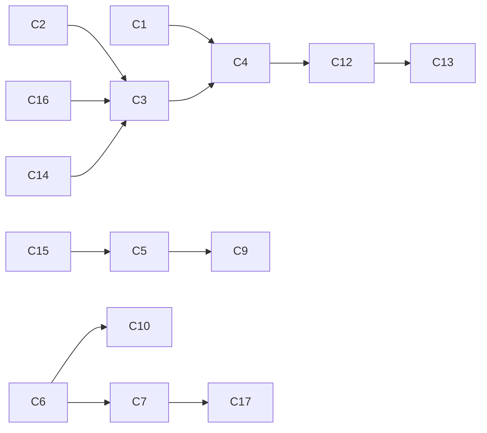

# podcast Department — Concept Map (F1 output, the WHY)

Status: **LOCKED** — derives ONLY from `interview/intent-interview.md`.
INTENT LOCK provenance: decided_by Ankit, 2026-07-22, Claude Code
AskUserQuestion surface, readback round 3 ("LOCK IT").

Rules:
- Every node cites the interview question it derives from (Q1..Q16 + EDGE rounds).
- Nothing appears here that the owner did not say or confirm at readback.
- The procedural graph (F2) must trace every node back to THIS map; anything
  that traces to nothing is a lint failure.

## Spine (one sentence)

For Ankit, the podcast department GOVERNS the existing OBE podcast loop estate —
sensing every loop, send lane, publish outcome, guest manifest, and the alert
channel itself; healing known failures; escalating unknown ones exactly once —
so that episodes ship on ≤1 hour of Ankit's time, nothing fails silently, the
pipeline stays ≥6 guests, and every guest has a complete info + promo manifest
tracked in HubSpot.

## Nodes

| ID | Concept | From | Notes (owner's words where possible) |
|---|---|---|---|
| C1 | Outcome owed: ≤1 hr founder time/episode + zero silent failures + pipeline ≥6 guests, co-equal over 90 days | Q1 | "All three, as stated" |
| C2 | Architecture: govern + harden the existing estate, no migration; department = manager/watchdog; runtime stays in podcast repo + VPS | Q2 | "Govern + harden, no migration" |
| C3 | V1 proving slice: ONE watchdog with three sensor families — loop/timer/receipt/escalation-channel health, independent pipeline count, publish-day verification | Q3 | "we need all of htes so loop watch dog shou dlhave piple in and publisday" |
| C4 | Setpoints (provisional, ratify after shadow week): detection ≤30 min (15-min loops) / ≤26 h (daily); pipeline ≥6 via independent calendar+HubSpot join; publish verified by 10:30 ET; founder-time TBD_MEASURE_IN_SHADOW; ops ceiling: sense every 30 min, ≤5 pings/day then digest | Q4 | "Accept provisional" |
| C5 | Automation posture: FULL AUTO. Estate outreach sends promoted to autosend NOW behind QA gates; auto-heal known patterns (logged); watchdog itself never sends outreach — outbound is escalations only | Q5 | "full auto with sends now and auto-heals adn qa gates beof autosends" |
| C6 | Guest info manifests: for every guest/episode, gather a complete information manifest (headshot, links, bio, …) AND a promotional info manifest — "not only scheduling but the info as well" | Q5 | owner's new first-class goal |
| C7 | HubSpot = central source of truth for manifest completeness, requirement statuses, and notes; VPS remains media/pipeline runtime truth (2026-06-10 decision) — defined boundary, not conflict | Q7 | "all data is stored inside of hubspot as cerntral soruce of truth" |
| C8 | Budget: subscription/OAuth lanes ONLY, $0 API — what can't run on subscription escalates instead of spending; existing send caps stay (12/day, 5 new contacts/day, cadence floor); 4 h/day worker ceiling; 80% auto-stop | Q6 | "Subscription-only, $0 API" |
| C9 | Kill backstops (should be unreachable if QA + manifests work): reputation-damaging autosend kills that send class; watchdog false-green kills the watchdog; 2-week net plate-load kill; floor-breach kills the class | Q7 | "we should never get to kill if we are proly qa" |
| C10 | Publish policy: episodes ALWAYS ship on schedule when QA passes; missing manifest items get deterministic fallback assets so promo ships too; chase continues; fallback usage recorded in HubSpot | EDGE-manifest | "Publish with fallback assets" |
| C11 | Hard floors: no live hand-patching of VPS/runtime (heals = known playbooks, logged); no VPS redeploy from master while v2 unmerged; never suppress/downgrade RED; governance files human-only; PHI entirely out of domain (its appearance = escalation) | Q5, readback r1 | "phi not relevant" |
| C12 | Escalation policy (PRIORITY): dedup by incident fingerprint — one incident = one thread; escalate once, fix forever — every escalation spawns a root-cause improvement item; repeat escalation of a resolved fingerprint = department defect; target ZERO repeats | readback r2 | "any escaltions dont escalte agin so that is priorty" |
| C13 | Escalation delivery: Telegram ping (primary) + Linear card (durable); 24 h silence = re-file louder on same thread; NEVER auto-approve on silence | Q14 (evidence-derived, confirmed at readback) | |
| C14 | Script-vs-LLM triage: sensing, gates, heals, caps, completeness checks, idempotency, reconcile = SCRIPTS; LLM only drafts content and judges it (always cross-model) | Q8 (evidence-derived, confirmed) | |
| C15 | Boundary rules: prep-stage triple-touch consolidation is a hardening item; sales state stays OUT of podcast fields; frequency/suppression caps apply per contact ACROSS all lanes; unresolved identity = suppress + review; dup contact = create + cross-ref note, never conflate | Q9/Q10 (evidence-derived, confirmed) | |
| C16 | Subtle failures (lived, now first-class): silent media corruption that survives sampling QA (E102 PTS collapse) and silent infra failure that kills its own alert channel (2026-07-22 prep-sweep IAM) → executed checks as gates + escalation-channel liveness sensing; negative tests: poisoned fixtures must FAIL gates | Q12/Q13 (evidence-derived, confirmed) | |
| C17 | Cross-department seams: podcast emits handoff packets consumable by a future sales department and other future departments; each department owns its own state; wiring a new consumer is an owner-level estate event | readback r1 | "shoudl als interact with sles and future deparntmetns" |
| C18 | Records: local receipts/runs/STATE always on under departments/podcast/state/; never recorded: credentials, PHI, raw message bodies | Q15 (evidence-derived, confirmed) | |

## Edges (what feeds what)

## Open questions (never fake definitions)

- Founder-time-per-episode numeric target: TBD_MEASURE_IN_SHADOW (Q4).
- Manifest field list (exact required items per guest/episode): owner named
  "headshot, links" explicitly + "etc" — the full field list is derived in the
  plan from the existing asset-request lane and presented for owner review, not
  invented here.
- Manifest completeness target %: TBD_MEASURE_IN_SHADOW.

## INTENT LOCK

Status: **LOCKED**. Provenance: decided_by **Ankit**, date **2026-07-22**,
surface **Claude Code (AskUserQuestion, readback round 3)**.
